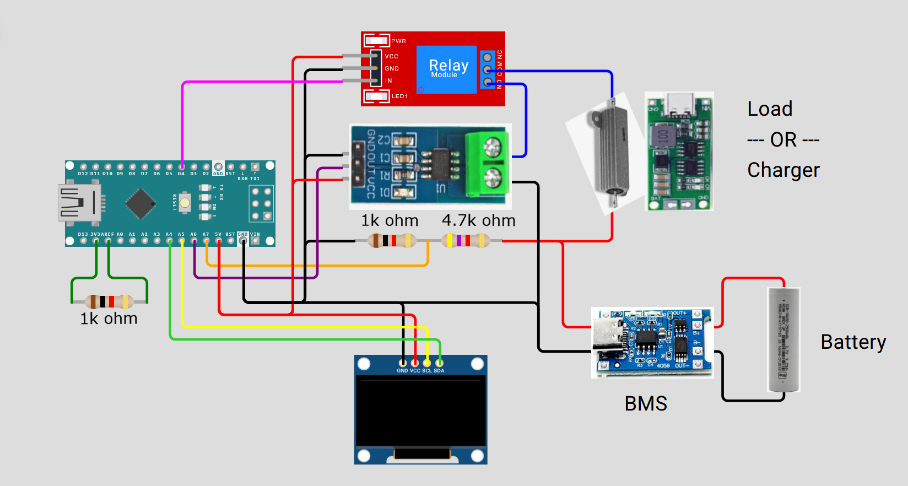
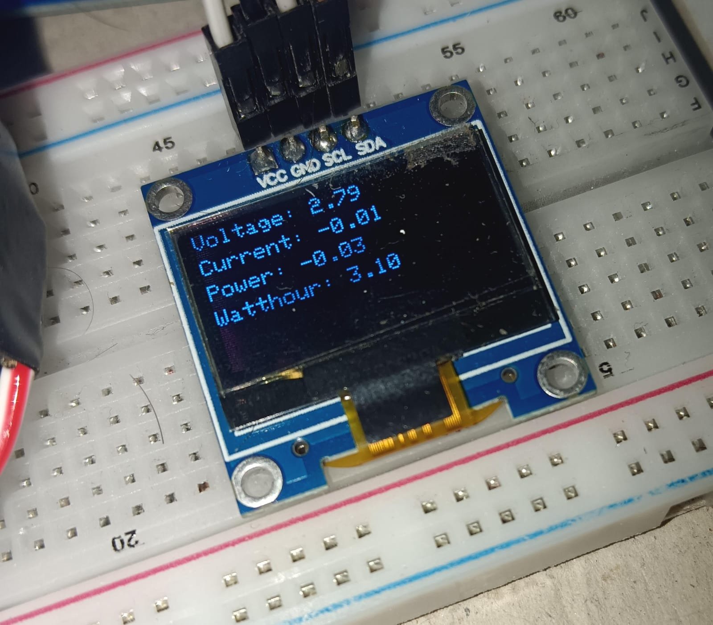
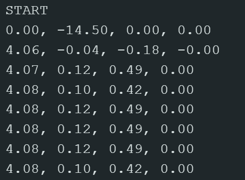
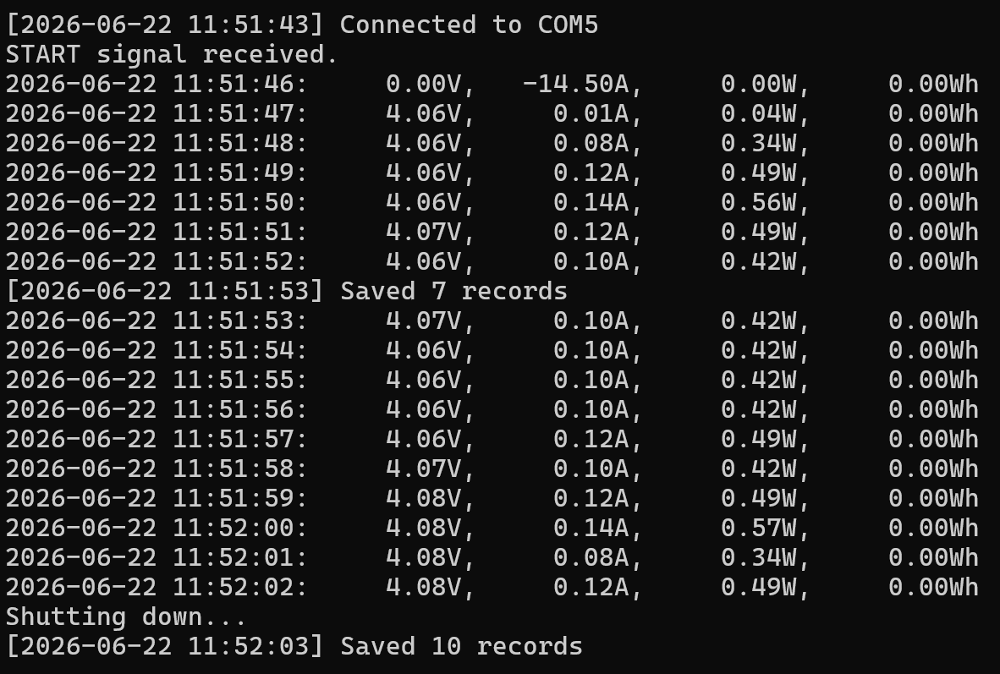
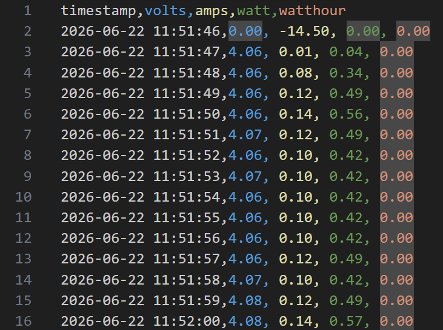
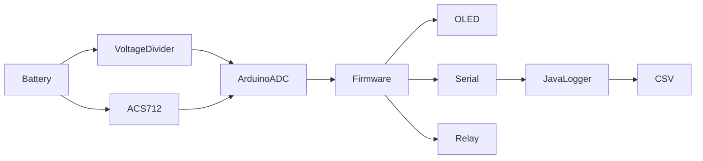

# Arduino Battery Capacity Tester

## Introduction

Arduino Battery Capacity Tester is a simple hardware and software project for measuring battery discharge or charge characteristics using an Arduino-compatible microcontroller, an ACS712 current sensor, a voltage divider, and a relay.

The project continuously samples battery voltage and current, calculates power consumption, and integrates power over time to estimate energy in watt-hours (Wh). Two firmware variants are provided:

* **OLED Display Mode** – Displays live measurements directly on an SSD1306 OLED display.
* **Serial Logging Mode** – Streams measurements over a serial port for long-term logging and analysis on a computer.

A companion Java application automatically captures serial output and stores measurements in timestamped CSV files.

---

## Tech Stack

### Firmware

* C++
* Arduino Framework
* Wire Library
* Adafruit GFX Library
* Adafruit SSD1306 Library

### Desktop Logger

* Java 21
* Maven
* jSerialComm

### Output Formats

* CSV

---

## Project Structure

```text
.
│   LICENSE
│   README.md
│
├── capacity_meter_disp
│   └── capacity_meter_disp.ino
│
├── capacity_meter_serial
│   └── capacity_meter_serial.ino
│
├── Images
│   ├── csv.png
│   ├── disp.jpeg
│   ├── serial_logger.png
│   ├── serial_raw.png
│   └── wiring_diagram.png
│
└── Serial_listener
    │   pom.xml
    │
    ├── Build
    │   └── serial-listener-1.0-jar-with-dependencies.jar
    │
    ├── data
    │   └── *.csv
    │
    ├── src
    │   └── main
    │       └── java
    │           └── com
    │               └── example
    │                   └── SerialListenerApp.java
    │
    └── target
        └── Maven build output
```

---

### Minimum Project Requirements

#### Firmware & Hardware

* Arduino-compatible board with at least two analog inputs
* ACS712 current sensor
* Relay module (arduino compatible)
* 3 resistors (1k, 1k, 5k)
* Battery with protection circuit
* Charging module/Load resistors
* Optional SSD1306 OLED display

#### Desktop Logger (optional)

* Java 21 or newer
* Maven (for building from source)

---

## Hardware Setup & Calibration

The wiring diagram below shows the reference circuit used by this project.



---

### Battery Capacity Test While Charging

For charge-capacity measurements:

1. Connect charger positive directly to battery positive.
2. Connect charger negative to the relay **NO (Normally Open)** terminal.
3. The relay and current sensor will monitor and disconnect charging when the configured voltage limit is reached.

---

### Battery Capacity Test While Discharging

For discharge-capacity measurements:

1. Connect the load positive terminal to battery positive.
2. Connect the load negative terminal to the relay **NO (Normally Open)** terminal.
3. A **5 Ω / 5 W resistor** is suitable for testing a typical single-cell 3.7 V Li-ion battery.

The relay will disconnect the load when the battery reaches the configured minimum voltage.

---

### Before uploading the firmware:

1. Measure the AREF voltage using a multimeter.
2. Measure the actual resistor values used in the voltage divider.
3. Check the linear step voltage per amp of your current sensor.
4. Check battery minimum and maximum safe voltage.
5. Double check the wiring and note pin numbers.

Now update these values in code to match your hardware otherwise the data will not be accurate.

**Notes:**
- Ensure voltage measurement and current sensor are on analog pins.
- Arduino logs the data at the baudrate of 115200.
- Serial logger companion is hardcoded for baudrate 115200.


---

## Usage

### OLED Display Variant

Upload:

```text
capacity_meter_disp/capacity_meter_disp.ino
```

Output:


---

### Serial Logging Variant

Upload:

```text
capacity_meter_serial/capacity_meter_serial.ino
```

Output format:

```text
volts, amps, watts, watthour
```

Output in arduino serial monitor:



---

## Serial logger

The serial logger listens on provided COM port of your pc (windows assumed), logs the data in console and save it if form of csv file inside `Serial_listener/data`

To run the pre-built serial logger jar, you need to have Java installed in your system. And also maven if you want to run java code or build your own jar file.

---

### Run pre-built JAR

Open a command terminal inside `Serial_listener` folder, then run:

```bash
java -jar Build/serial-listener-1.0-jar-with-dependencies.jar COM5
```

- Replace `COM5` with the serial port connected to arduino.
- Use `ctrl + c` to stop the execution of logger.

---

### Run Logger Using Maven

```bash
mvn clean compile exec:java -Dexec.args="COM5"
```

---

### Build Standalone JAR

```bash
mvn clean package
```

Generated artifact:

```text
target/serial-listener-1.0-jar-with-dependencies.jar
```

To run the new jar:

```bash
java -jar target/serial-listener-1.0-jar-with-dependencies.jar COM5
```

---

#### Logger output



---

### CSV Output

Generated files are stored in:

```text
Serial_listener/data/
```

Format:

```csv
timestamp,volts,amps,watt,watthour
2026-06-22 01:09:13,3.95,0.72,2.84,0.12
```

CSV sample:


---

## How It Works

### System Architecture



### Measurement Process

1. The battery voltage is scaled using a resistor divider.
2. The ACS712 sensor produces an analog voltage proportional to current.
3. The Arduino samples voltage and current every 50 ms.
4. Samples are averaged over a 1-second interval.
5. Arduino calculates:

   * Voltage (V)
   * Current (A)
   * Power (W)
   * Energy (Wh)
6. If voltage exceeds configured safety thresholds:

   * Relay is disabled
   * Built-in LED is illuminated
7. Based on uploaded code, measurements are either:

   * Displayed on an OLED screen, or
   * Sent over the serial port

### Energy Calculation

The firmware computes:

```text
Power = Voltage × Current

Energy(Wh) += Power × Time(hours)
```

The accumulated watt-hour value is updated every polling interval.

---

## Features

* Battery voltage measurement using an analog voltage divider
* Current measurement using an ACS712 current sensor
* Real-time power calculation (Watts)
* Energy accumulation (Watt-hours)
* Automatic relay cutoff when voltage exceeds configured limits
* Configurable charge/discharge voltage thresholds
* Configurable hardware calibration constants
* OLED display support using SSD1306 displays
* Serial telemetry output at 1-second intervals
* Automatic CSV logging on a computer
* Automatic serial reconnection handling
* Automatic log file rotation when the device restarts
* Buffered disk writes for reduced filesystem overhead

---

## Limitations

* Designed around analog current sensing using ACS712.
* Measurement accuracy depends on calibration of:

  * AREF voltage
  * Voltage divider resistors
  * ACS712 sensor characteristics
* Watt-hour calculation is based on periodic sampling and numerical integration rather than laboratory-grade instrumentation.
* Only a single relay control output is implemented.
* Firmware is configured for a single battery channel.
* ESP8266 is not supported because two analog inputs are required.
* No persistent storage exists on the microcontroller; accumulated watt-hour values reset on reboot.
* No temperature monitoring or thermal protection is implemented.
* CSV logging relies on a connected computer when using the serial variant.

---

## Warning

### Warning

* Use at your own risk.
* This project is provided without guarantees.
* It is strongly recommended to use batteries with appropriate protection circuitry (BMS).
* Exceeding the voltage limits of the microcontroller can permanently damage the hardware.
* If measuring above 15 volts or current above 1.5 amps, take your time to know what you are doing and use properly rated hardware.
* Incorrect wiring, inadequate protection circuitry, or improper battery handling may result in equipment damage, overheating, fire, or personal injury.

---

## Disclaimer

### Educational Purpose Only

This project is intended for educational, research, and learning purposes only.

The authors are not responsible for misuse of the software or any consequences arising from its use.

---

## Contributing

Feedback, bug reports, feature requests, suggestions, and pull requests are welcome.

When submitting changes:

1. Clearly describe the problem being solved.
2. Include relevant testing information.
3. Keep modifications focused and well documented.

---

## License

This project is licensed under the MIT License.

See the `LICENSE` file for the complete license text.
