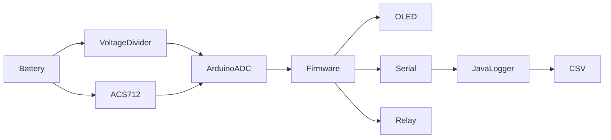
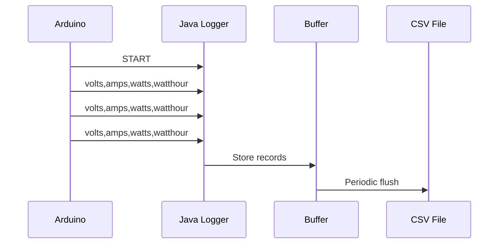

# Arduino Battery Capacity Tester

## Introduction

Arduino Battery Capacity Tester is a simple hardware and software project for measuring battery discharge or charge characteristics using an Arduino-compatible microcontroller, an ACS712 current sensor, a voltage divider, and a relay.

The project continuously samples battery voltage and current, calculates power consumption, and integrates power over time to estimate energy in watt-hours (Wh). Two firmware variants are provided:

* **OLED Display Mode** – Displays live measurements directly on an SSD1306 OLED display.
* **Serial Logging Mode** – Streams measurements over a serial port for long-term logging and analysis on a computer.

A companion Java application automatically captures serial output and stores measurements in timestamped CSV files.

---

## Features

* Battery voltage measurement using an analog voltage divider
* Current measurement using an ACS712 current sensor
* Real-time power calculation (Watts)
* Energy accumulation (Watt-hours)
* Automatic relay cutoff when voltage exceeds configured limits
* Configurable charge/discharge voltage thresholds
* Configurable hardware calibration constants
* OLED display support using SSD1306 displays
* Serial telemetry output at 1-second intervals
* Automatic CSV logging on a computer
* Automatic serial reconnection handling
* Automatic log file rotation when the device restarts
* Buffered disk writes for reduced filesystem overhead

---

## Tech Stack

### Firmware

* C++
* Arduino Framework
* Wire Library
* Adafruit GFX Library
* Adafruit SSD1306 Library

### Desktop Logger

* Java 21
* Maven
* jSerialComm

### Output Formats

* CSV

---

## Project Structure

```text
.
│   LICENSE
│   README.md
│
├── capacity_meter_disp
│   └── capacity_meter_disp.ino
│
├── capacity_meter_serial
│   └── capacity_meter_serial.ino
│
├── Images
│   ├── csv.png
│   ├── disp.jpeg
│   ├── serial_logger.png
│   ├── serial_raw.png
│   └── wiring_diagram.png
│
└── Serial_listener
    │   pom.xml
    │
    ├── Build
    │   └── serial-listener-1.0-jar-with-dependencies.jar
    │
    ├── data
    │   └── *.csv
    │
    ├── src
    │   └── main
    │       └── java
    │           └── com
    │               └── example
    │                   └── SerialListenerApp.java
    │
    └── target
        └── Maven build output
```

### Key Files

| File                        | Purpose                   |
| --------------------------- | ------------------------- |
| `capacity_meter_disp.ino`   | OLED display firmware     |
| `capacity_meter_serial.ino` | Serial logging firmware   |
| `SerialListenerApp.java`    | Desktop serial logger     |
| `pom.xml`                   | Maven build configuration |
| `Images/wiring-diagram.png` | Hardware wiring reference |

---

## How It Works

### System Architecture



### Measurement Pipeline

1. The battery voltage is scaled using a resistor divider.
2. The ACS712 sensor produces an analog voltage proportional to current.
3. The Arduino samples voltage and current every 50 ms.
4. Samples are averaged over a 1-second interval.
5. Firmware calculates:

   * Voltage (V)
   * Current (A)
   * Power (W)
   * Energy (Wh)
6. If voltage exceeds configured safety thresholds:

   * Relay is disabled
   * Built-in LED is illuminated
7. Measurements are either:

   * Displayed on an OLED screen, or
   * Sent over the serial port

### Energy Calculation

The firmware computes:

```text
Power = Voltage × Current

Energy(Wh) += Power × Time(hours)
```

The accumulated watt-hour value is updated every polling interval.

### Serial Logging Workflow



The logger:

* Connects to the configured serial port
* Waits for device availability
* Reconnects automatically after disconnects
* Buffers records in memory
* Writes CSV batches to disk
* Creates new log files when the device restarts

---


### Minimum Requirements

#### Firmware

* Arduino-compatible board with at least two analog inputs
* ACS712 current sensor
* Relay module (arduino compatible)
* Voltage divider resistors
* Optional SSD1306 OLED display

#### Desktop Logger

* Java 21 or newer
* Maven (for building from source)

---

## Usage

### OLED Display Variant

Upload:

```text
capacity_meter_disp/capacity_meter_disp.ino
```

The OLED display shows:

* Voltage
* Current
* Power
* Watt-hours

---

### Serial Logging Variant

Upload:

```text
capacity_meter_serial/capacity_meter_serial.ino
```

The firmware outputs lines in the format:

```text
volts, amps, watts, watthour
```

Example:

```text
3.97, 0.74, 2.93, 1.24
```

---

## Serial logger companion

Open a command terminal inside `Serial_listener` folder, then:

### Run pre-built JAR (only java required)

Run:

```bash
java -jar Build/serial-listener-1.0-jar-with-dependencies.jar COM5
```

Use `ctrl + c` to stop the execution of logger.

---

### Run Logger Using Maven (java + maven needed)

```bash
mvn clean compile exec:java -Dexec.args="COM5"
```

Replace `COM5` with the serial port used by your device.

---

### Build Standalone JAR (java + maven needed)

```bash
mvn clean package
```

Generated artifact:

```text
target/serial-listener-1.0-jar-with-dependencies.jar
```

Run:

```bash
java -jar target/serial-listener-1.0-jar-with-dependencies.jar COM5
```

---

### CSV Output

Generated files are stored in:

```text
Serial_listener/data/
```

CSV format:

```csv
timestamp,volts,amps,watt,watthour
2026-06-22 01:09:13,3.95,0.72,2.84,0.12
```

---

## Configuration

All firmware configuration is contained directly in the Arduino source files.

### Voltage Limits

```cpp
#define MAX_BATTERY_VOLT 4.15
#define MIN_BATTERY_VOLT 2.95
```

Used for relay cutoff protection.

---

### Voltage Divider

```cpp
#define R1 4700
#define R2 980
```

Must match the actual resistor values used in hardware.

---

### Current Sensor

```cpp
#define ACS_STEP_VOLT 0.185
```

Configured for an ACS712 5A module.

---

### ADC Reference

```cpp
#define AREF_VOLT 3.285
```

External analog reference voltage, must not exceed 5 volts.

---

### Sampling Settings

```cpp
#define SAMPLE_INTERVAL 50
#define POLL_INTERVAL 1000
```

* Sample every 50 ms
* Calculate and publish results every 1000 ms or 1 second

---

### Hardware Pins

```cpp
#define VOLTAGE_PIN A7
#define CURRENT_PIN A6
#define RELAY_PIN   4
```

Modify as required for the target board.

---

### OLED Configuration

```cpp
#define DISPLAY_ADDRESS 0x3C
```

SSD1306 I²C address.

---

### Java Logger Configuration

Located in `SerialListenerApp.java`.

| Setting         | Value       |
| --------------- | ----------- |
| Baud Rate       | 115200      |
| Flush Threshold | 100 records |
| Flush Interval  | 10 seconds  |
| Data Directory  | `./data`    |

---

## Images

The repository includes reference images:

* `Images/wiring_diagram.png` – Circuit wiring diagram
* `Images/disp.jpeg` – OLED display example
* `Images/serial_logger.png` – Serial output from logger example
* `Images/serial_raw.png` – Serial output from arduino example
* `Images/csv.png` – CSV logging example

---

## Limitations

* Designed around analog current sensing using ACS712.
* Measurement accuracy depends on calibration of:

  * AREF voltage
  * Voltage divider resistors
  * ACS712 sensor characteristics
* Watt-hour calculation is based on periodic sampling and numerical integration rather than laboratory-grade instrumentation.
* Only a single relay control output is implemented.
* Firmware is configured for a single battery channel.
* ESP8266 is not supported because two analog inputs are required.
* No persistent storage exists on the microcontroller; accumulated watt-hour values reset on reboot.
* No temperature monitoring or thermal protection is implemented.
* CSV logging relies on a connected computer when using the serial variant.

---

## Warning

### Warning

* Use at your own risk.
* This project is provided without guarantees.
* It is strongly recommended to use batteries with appropriate protection circuitry (BMS).
* Exceeding the voltage limits of the microcontroller can permanently damage the hardware.
* If measuring above 15 volts or current above 1.5 amps, take your time to know what you are doing and use properly rated hardware.
* Incorrect wiring, inadequate protection circuitry, or improper battery handling may result in equipment damage, overheating, fire, or personal injury.

---

## Disclaimer

### Educational Purpose Only

This project is intended for educational, research, and learning purposes only.

The authors are not responsible for misuse of the software or any consequences arising from its use.

---

## Contributing

Feedback, bug reports, feature requests, suggestions, and pull requests are welcome.

When submitting changes:

1. Clearly describe the problem being solved.
2. Include relevant testing information.
3. Keep modifications focused and well documented.

---

## License

This project is licensed under the MIT License.

See the `LICENSE` file for the complete license text.
